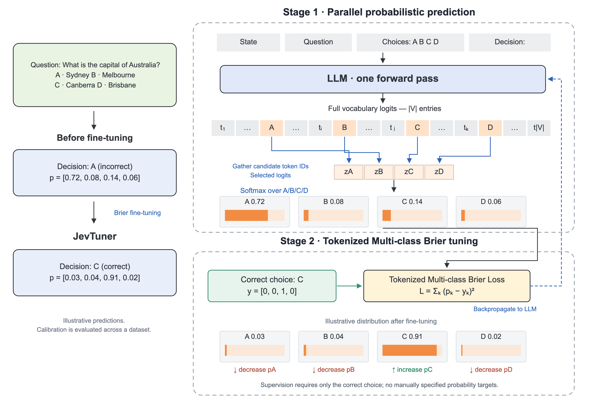

<div align="center">

# JevTuner

### Train language models to make fast, calibrated probabilistic decisions

[](https://www.python.org/)
[](https://pytorch.org/)
[](https://huggingface.co/Qwen/Qwen3-8B)
[](https://arxiv.org/abs/2508.18847)

**State + typed question → decision + complete probability distribution**

</div>

JevTuner applies the core idea of
[ConfTuner](https://github.com/liushiliushi/ConfTuner)—directly training the
probability distribution represented by token logits—to closed-set decision
tasks. Instead of generating a long response and then reporting a separate
confidence value, the model scores every candidate decision in one forward pass.



## Why JevTuner?

- **One forward pass.** All candidate logits are read simultaneously; no
  autoregressive answer generation is required.
- **Complete distribution.** Every request returns a normalized probability for
  each allowed decision, not only the top choice.
- **Direct probability tuning.** Tokenized Multi-class Brier Loss optimizes the
  entire distribution against a one-hot decision target.
- **Closed output space.** The result always maps back to one of the choices
  supplied by the caller.

## How it works

### 1. Select candidate logits from the vocabulary

The language model produces logits over its complete vocabulary of size
$|V|$. JevTuner gathers the token logits corresponding to the candidate
decision slots:

$$
\mathbf{z}_{\text{decision}}
= [z_A, z_B, \ldots, z_K].
$$

The implementation adds reserved single-token slots
`<|decision_0|>`, `<|decision_1|>`, ... to the tokenizer. These internal slots
are mapped to the request's choice strings, so arbitrary labels remain
single-token decisions.

### 2. Produce the full decision distribution

Softmax is applied only across the selected candidate logits:

$$
p_k = \frac{\exp(z_k)}{\sum_j \exp(z_j)}.
$$

The final decision is `argmax(p)`, while the entire distribution remains
available to downstream software.

### 3. Tune probabilities with Multi-class Brier Loss

Given a one-hot target $\mathbf{y}$, JevTuner directly minimizes:

$$
\mathcal{L}_{\text{Brier}}
= \sum_k (p_k-y_k)^2.
$$

A confidently wrong decision receives a large penalty. Increasing probability
on the correct candidate and reducing probability on incorrect candidates lowers
the loss. Training requires only the final correct choice—no manually authored
probability targets.

## Quick start

### Installation

```bash
git clone https://github.com/liushiliushi/JevTuner.git
cd JevTuner
pip install -r requirements.txt
```

### Data

Training data uses JSON Lines with one decision per row:

```json
{"state":"The customer says they were charged twice.","question":"Which team should handle this?","choices":["billing","technical","sales","other"],"label":0}
```

`label` is the zero-based index of the correct choice. Examples may contain
different labels and different numbers of choices, up to `--max_choices`.

### Training

```bash
cd src
python jevtuner.py train \
  --model_name Qwen/Qwen3-8B \
  --train_file ../examples/decisions.jsonl \
  --output_dir ../checkpoints/jevtuner \
  --use_peft True
```

### Inference

```bash
python jevtuner.py decide \
  --model_name ../checkpoints/jevtuner \
  --state "The customer says they were charged twice." \
  --question "Which team should handle this?" \
  --choices '["billing", "technical", "sales", "other"]'
```

```json
{
  "decision": "billing",
  "probabilities": {
    "billing": 0.84,
    "technical": 0.09,
    "sales": 0.03,
    "other": 0.04
  }
}
```

## Project scope

JevTuner is an open implementation of the decision-first idea exposed by
TypeSafe AI's Jev API. Jev is closed source: TypeSafe publicly names its
training method Reinforcement Learning for Calibrated Decisions (RLCD), but has
not published its loss or architecture. JevTuner therefore does not claim to
reproduce TypeSafe's private implementation.

## Attribution

JevTuner builds on [ConfTuner](https://github.com/liushiliushi/ConfTuner),
accepted at NeurIPS 2025, and retains the upstream license notices. “Jev” is a
product of TypeSafe AI; this project is unofficial and unaffiliated.

<div align="center">

[ConfTuner paper](https://arxiv.org/abs/2508.18847) ·
[ConfTuner repository](https://github.com/liushiliushi/ConfTuner) ·
[Jev announcement](https://typesafe.ai/blog/introducing-system-one-models-and-jev)

</div>
